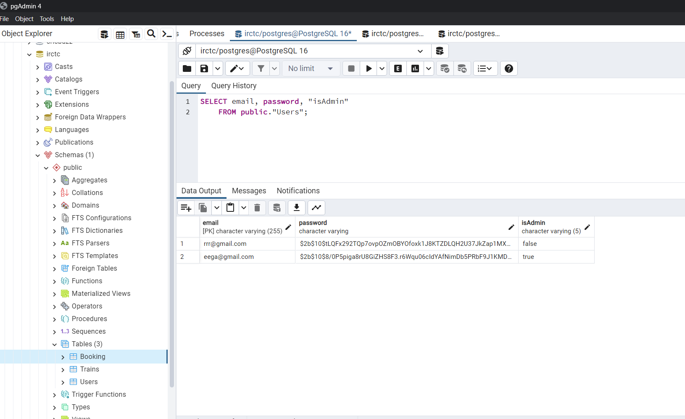
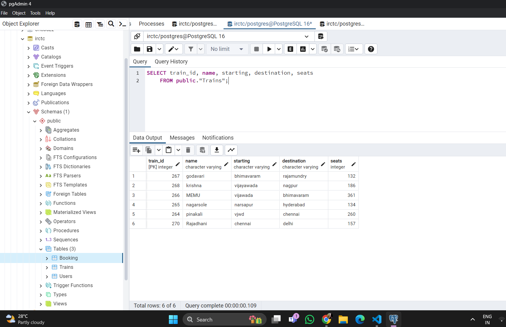
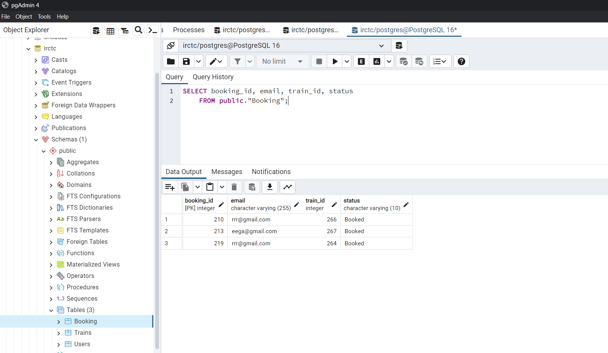
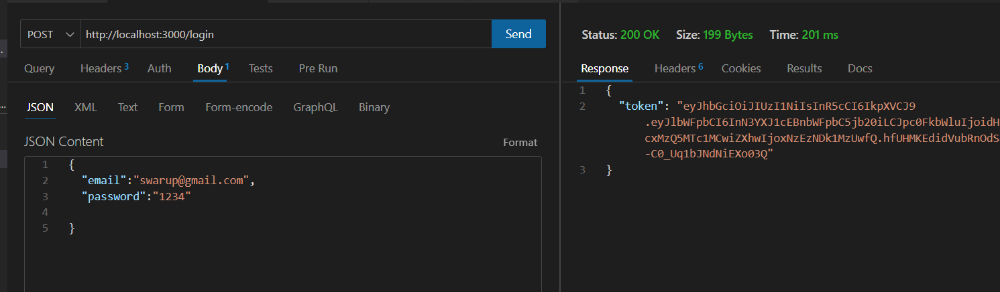
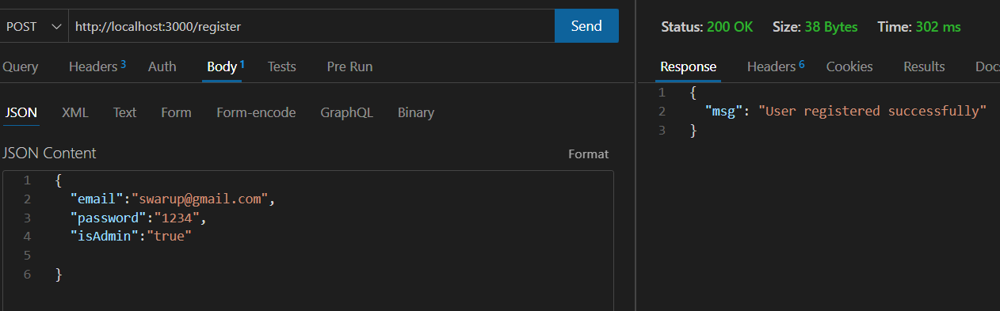
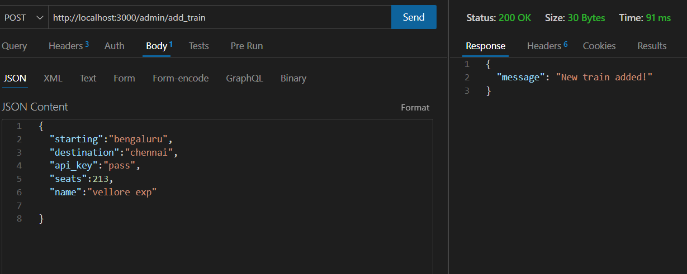
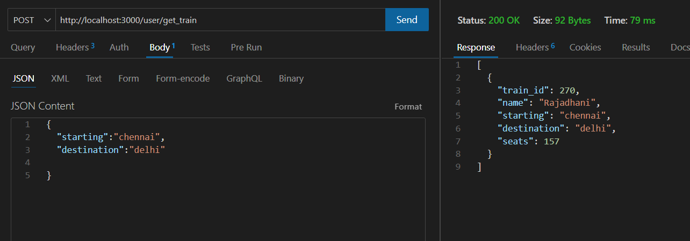
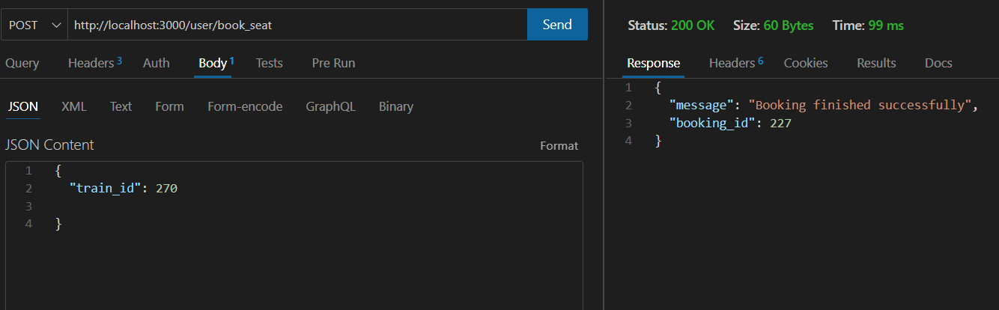
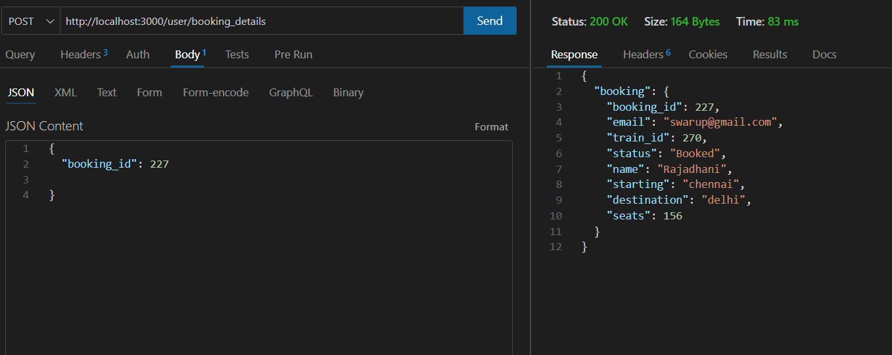

# IRCTC Backend
This repository contains the backend code for the IRCTC, backend for managing trains and its users using Node.js, Express, and PostgreSQL.

## Table of Contents
- [Project Overview](#project-overview)
- [Prerequisites](#prerequisites)
- [Project Structure](#project-structure)
- [Getting Started](#getting-started)
  - [Installation](#installation)
  - [Configuration](#configuration)
- [API Endpoints](#api-endpoints)


## Project Overview
This project is a railway management system designed to provide various functionalities related to train booking and management. It is implemented using Express.js for the backend, PostgreSQL for the database, and includes features such as user registration, login, adding new trains, checking seat availability, booking seats, and retrieving booking detail.

## Prerequisites
Before setting up the backend, make sure you have the following prerequisites installed on your system:
- [Node.js](https://nodejs.org/): Version 14 or higher
- [PostgreSQL](https://www.postgresql.org/): Version 12 or higher

## Project Structure
The project structure is organized as follows:
```
irctc/
├── index.js # Main application file
├── database # Database connection 
├── package.json # Node.js dependencies and scripts
├── Middleware # Contains middleware restricting API calls
└── functions # Project Functionalities

```


## Getting Started
Follow these steps to set up and run the IRCTC backend:

### Installation
1. Clone the repository:
-git clone https://github.com/swarupe7/irctc.git

-cd irctc

2. Install dependencies:
-npm install

### Configuration
Create a PostgreSQL database and update the database connection configuration in `db.js` with your database credentials.


## API Endpoints
The following API endpoints are available:

### Common Endpoints:
- `POST /login`: Login a user.
- `POST /register`: Register a user.

### Admin Endpoints:
- `POST /admin/add_train`: Create a new train route.

### User Endpoints:
- `POST /user/get_train`: Get train details based on route.
- `POST /user/book_seat`: book seats for user by TrainID.
- `POST /user/booking_details`: Get Booking details by BookingID.

## Pictures
Pictures of Tables




Pictures of Endpoints








